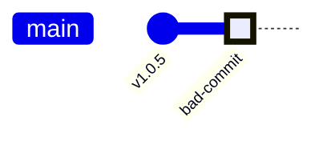
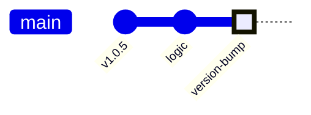

# 기여 가이드 (Contributing Guidelines)

DataGrip Dataset Downloader 플러그인 프로젝트의 유지보수성과 확장성을 위해, 코드 기여 및 버전 관리 시 아래의 컨벤션 규칙을 반드시 준수해야 함.

---

## 1. 커밋 메시지 컨벤션

커밋 메시지는 목적에 따라 Prefix를 분리하여 작성함.

*   `feat(scope):` 새로운 기능 추가
*   `fix(scope):` 버그 수정
*   `perf(scope):` 성능 향상을 위한 아키텍처/코드 수정
*   `refactor(scope):` 기능 변화 없는 코드 구조 재조정
*   `chore(scope):` 빌드 스크립트, 설정, 문서 등 로직 외 변경

## 2. [핵심] 기능 변경과 버전 펌핑(Version Bump) 커밋 분리 원칙

기능을 추가하거나 코드를 개선한 뒤 릴리스 버전을 올릴 때는, **반드시 실제 로직이 담긴 커밋과 버전을 올리는 커밋을 분리**해야 함. 이를 통해 추후 롤백이나 체리픽(Cherry-pick) 시 버전 파일(`build.gradle.kts` 등)에서 발생하는 충돌을 방지할 수 있음.

### 🚫 잘못된 커밋 흐름 (Bad Practice)
버전 변경과 코드 로직 변경이 하나의 커밋에 섞여 있으면, 롤백 시 버전 번호까지 과거로 돌아가버려 릴리스 관리가 꼬이게 됨.

### ✅ 올바른 커밋 흐름 (Good Practice)
로직을 먼저 커밋한 후, 버전을 올리는 단일 목적의 커밋(`chore`)을 마지막에 독립적으로 쌓아야 함.
버전 업데이트 커밋의 메시지는 무조건 `chore(build): bump version to x.x.x` 포맷을 준수함.

### 분리 적용 가이드

**Step 1. 기능 개선 및 버그 수정 커밋**
*   대상: `src/` 내의 코드 파일들
*   명령어: `git commit -m "perf(service): 기능 개선 내용"`

**Step 2. 릴리스를 위한 버전 펌프 커밋**
*   대상: `build.gradle.kts`, `gradle.properties`, `CHANGELOG.md`
*   명령어: `git commit -m "chore(build): bump version to 1.0.6"`

---

## 3. 코드 작성 가이드라인
*   **확장성과 유지보수성 최우선:** 단순 하드코딩을 지양하고, 재사용 가능한 모듈 단위로 작성할 것.
*   **성능 최적화 (Zero-Allocation):** 대용량 DB 데이터를 다루므로, 무의미한 원시 타입 박싱(Boxing)이나 스트링 풀 등 GC(Garbage Collector) 부하를 유발하는 로직을 철저히 배제할 것.
*   **시각화:** 복잡한 아키텍처나 비동기 스레드 파이프라인(Producer-Consumer 등)을 추가할 경우, 반드시 Markdown에 `mermaid` 다이얼그램을 포함해 시각적으로 설명할 것.
