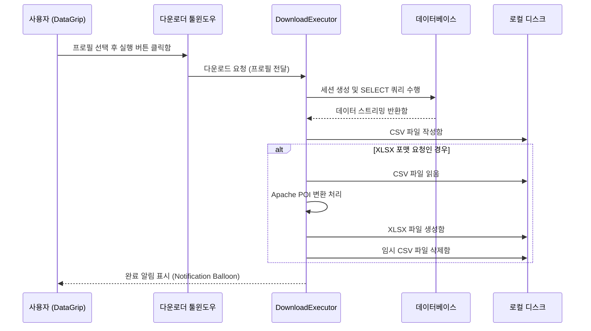

# DataGrip Dataset Downloader

DataGrip 환경에서 데이터베이스 테이블의 데이터셋을 프로필 단위로 관리하고, 로컬에 CSV 및 XLSX(Excel) 형식으로 손쉽게 다운로드할 수 있도록 지원하는 플러그인 프로젝트임.

---

## 1. 주요 기능

* **프로필 기반 저장**: 데이터소스, 스키마, 테이블, 다운로드 경로 및 포맷을 프로필로 등록하여 재사용 가능함.
* **다양한 저장 포맷 지원**:
  * **CSV**: UTF-8 BOM 형식을 지원하여 엑셀 가독성 향상시킴.
  * **XLSX**: 임시 CSV 추출 후 Apache POI (`SXSSFWorkbook` 스트리밍 기법)를 활용해 대용량 엑셀 파일로 자동 변환 및 임시 파일 자동 삭제 처리함.
* **사용자 정의 경로**: 플러그인 설정 및 개별 프로필 마다 고유 다운로드 폴더 지정 가능함.
* **영속화 기능**: IDE가 재부팅되어도 `PersistentStateComponent`에 의해 프로필 목록이 보존됨.

---

## 2. 시스템 아키텍처 및 데이터 흐름



---

## 3. 프로젝트 구조 및 주요 파일

* **빌드 스크립트**:
  * [build.gradle.kts](file:///Users/osh8242/Documents/data-download-plugin/build.gradle.kts): Gradle 빌드 스크립트 (IntelliJ Platform Plugin SDK 2.x 구성함)
  * [gradle.properties](file:///Users/osh8242/Documents/data-download-plugin/gradle.properties): JDK 17 빌드 경로 지정함
* **플러그인 설정**:
  * [plugin.xml](file:///Users/osh8242/Documents/data-download-plugin/src/main/resources/META-INF/plugin.xml): 플러그인 메타데이터 및 컴포넌트 선언함
* **소스 코드**:
  * [DataDownloadConfig.kt](file:///Users/osh8242/Documents/data-download-plugin/src/main/kotlin/com/github/plugin/datadownload/config/DataDownloadConfig.kt): 프로필 설정 영속화 서비스
  * [ProfileDialog.kt](file:///Users/osh8242/Documents/data-download-plugin/src/main/kotlin/com/github/plugin/datadownload/ui/ProfileDialog.kt): 프로필 생성/수정 UI 다이얼로그
  * [DataDownloadToolWindowFactory.kt](file:///Users/osh8242/Documents/data-download-plugin/src/main/kotlin/com/github/plugin/datadownload/ui/DataDownloadToolWindowFactory.kt): 툴윈도우 화면 프레임 및 액션 연동
  * [DownloadExecutor.kt](file:///Users/osh8242/Documents/data-download-plugin/src/main/kotlin/com/github/plugin/datadownload/service/DownloadExecutor.kt): 비동기 다운로드 및 파일 포맷 변환 처리 로직

---

## 4. 빌드 및 테스트 방법

### 1) 빌드 실행
* 프로젝트를 빌드하고 배포 가능한 플러그인 압축 파일(`.zip`)을 생성함.
```bash
./gradlew buildPlugin
```
* 빌드 결과물 경로: `build/distributions/data-download-plugin-1.0-SNAPSHOT.zip`

### 2) 로컬 디버깅 및 실행
* 개발자용 샌드박스 환경(DataGrip이 로드된 개발 전용 IDE)을 구동하여 개발한 기능을 바로 수동 테스트함.
```bash
./gradlew runIde
```
